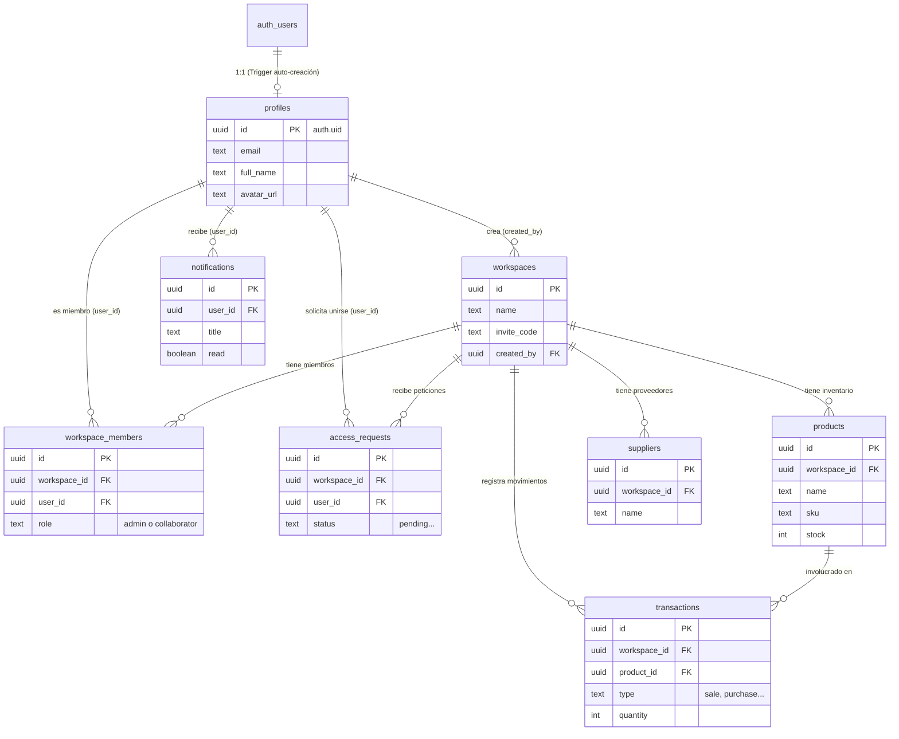

# Supabase Database Schema & Security Reference

Este documento sirve como la fuente única de verdad (Single Source of Truth) de la base de datos del proyecto. Contiene la arquitectura completa, dividida tabla por tabla, junto con sus funciones, políticas de seguridad (RLS) y disparadores (Triggers). 

---

## 🗺️ Diagrama de Entidad-Relación (Arquitectura)

Así es como todas las tablas de tu base de datos están conectadas entre sí de forma visual. El diagrama ilustra que un **Workspace** (Almacén) es el núcleo del sistema, y los productos, transacciones y proveedores giran en torno a él.



---

## 1. Helper Functions (Core Policies)

Funciones auxiliares (`Security Definer`) diseñadas para saltar el RLS internamente de forma segura y evitar bucles infinitos de recursión al evaluar permisos.

```sql
CREATE OR REPLACE FUNCTION public.get_user_workspaces()
RETURNS SETOF uuid
LANGUAGE sql;
```

```sql
CREATE OR REPLACE FUNCTION public.get_my_workspaces()
RETURNS SETOF uuid
LANGUAGE sql SECURITY DEFINER SET search_path = public
AS $$
  SELECT workspace_id FROM workspace_members WHERE user_id = auth.uid();
$$;
```

```sql
CREATE OR REPLACE FUNCTION public.is_workspace_admin(ws_id uuid)
RETURNS boolean
LANGUAGE sql SECURITY DEFINER SET search_path = public
AS $$
  SELECT EXISTS (
    SELECT 1 FROM workspace_members 
    WHERE workspace_id = ws_id AND user_id = auth.uid() AND role = 'admin'
  );
$$;
```

```sql
CREATE OR REPLACE FUNCTION public.is_workspace_creator(ws_id uuid)
RETURNS boolean
LANGUAGE sql SECURITY DEFINER SET search_path = public
AS $$
  SELECT EXISTS (
    SELECT 1 FROM workspaces WHERE id = ws_id AND created_by = auth.uid()
  );
$$;
```

---

## 2. Profiles

Almacena la información extendida de los usuarios. Se nutre automáticamente del registro de `auth.users`.

### Creación de Tabla

```sql
CREATE TABLE public.profiles (
  id uuid REFERENCES auth.users(id) ON DELETE CASCADE PRIMARY KEY,
  email text NOT NULL,
  full_name text,
  phone text,
  avatar_url text,
  created_at timestamp with time zone DEFAULT timezone('utc'::text, now()) NOT NULL
);
```

### Seguridad (RLS)

```sql
ALTER TABLE public.profiles ENABLE ROW LEVEL SECURITY;
```

```sql
CREATE POLICY "Ver perfiles" ON public.profiles FOR SELECT TO authenticated USING (true);
```

```sql
CREATE POLICY "Insertar perfil propio" ON public.profiles FOR INSERT TO authenticated WITH CHECK (id = auth.uid());
```

```sql
CREATE POLICY "Actualizar perfil propio" ON public.profiles FOR UPDATE TO authenticated USING (id = auth.uid());
```

### Triggers (Auto-creación de perfil)

```sql
CREATE OR REPLACE FUNCTION public.handle_new_user()
RETURNS trigger AS $$
BEGIN
  INSERT INTO public.profiles (id, email, full_name)
  VALUES (new.id, new.email, split_part(new.email, '@', 1));
  RETURN new;
END;
$$ LANGUAGE plpgsql SECURITY DEFINER;
```

```sql
CREATE TRIGGER on_auth_user_created
  AFTER INSERT ON auth.users
  FOR EACH ROW EXECUTE PROCEDURE public.handle_new_user();
```

---

## 3. Workspaces

Representa a las tiendas, compañías o almacenes.

### Creación de Tabla

```sql
CREATE TABLE public.workspaces (
  id uuid DEFAULT gen_random_uuid() PRIMARY KEY,
  name text NOT NULL,
  invite_code text UNIQUE NOT NULL,
  created_by uuid REFERENCES auth.users(id) ON DELETE SET NULL,
  settings jsonb DEFAULT '{}'::jsonb,
  created_at timestamp with time zone DEFAULT timezone('utc'::text, now()) NOT NULL
);
```

### Seguridad (RLS)

```sql
ALTER TABLE public.workspaces ENABLE ROW LEVEL SECURITY;
```

```sql
CREATE POLICY "Users can view their workspaces" ON public.workspaces FOR SELECT USING (
  id IN (SELECT get_my_workspaces())
);
```

```sql
CREATE POLICY "Users can create workspaces" ON public.workspaces FOR INSERT WITH CHECK (
  auth.uid() = created_by
);
```

```sql
CREATE POLICY "Admins can update workspaces" ON public.workspaces FOR UPDATE USING (
  is_workspace_admin(id)
);
```

```sql
CREATE POLICY "Admins can delete workspaces" ON public.workspaces FOR DELETE USING (
  is_workspace_admin(id)
);
```

---

## 4. Workspace Members

Maneja los permisos (`admin` o `collaborator`) de un usuario dentro de un workspace.

### Creación de Tabla

```sql
CREATE TABLE public.workspace_members (
  id uuid DEFAULT gen_random_uuid() PRIMARY KEY,
  workspace_id uuid REFERENCES public.workspaces(id) ON DELETE CASCADE,
  user_id uuid REFERENCES auth.users(id) ON DELETE CASCADE,
  role text NOT NULL DEFAULT 'collaborator' CHECK (role IN ('admin', 'collaborator')),
  created_at timestamp with time zone DEFAULT timezone('utc'::text, now()) NOT NULL,
  UNIQUE(workspace_id, user_id)
);
```

### Seguridad (RLS)

```sql
ALTER TABLE public.workspace_members ENABLE ROW LEVEL SECURITY;
```

```sql
CREATE POLICY "Users can view members of their workspaces" ON public.workspace_members FOR SELECT USING (
  workspace_id IN (SELECT get_my_workspaces())
);
```

```sql
CREATE POLICY "Creators can insert themselves" ON public.workspace_members FOR INSERT WITH CHECK (
  user_id = auth.uid() AND is_workspace_creator(workspace_id)
);
```

```sql
CREATE POLICY "Users can join workspaces" ON public.workspace_members FOR INSERT WITH CHECK (
  user_id = auth.uid()
);
```

```sql
CREATE POLICY "Admins can insert members" ON public.workspace_members FOR INSERT WITH CHECK (
  is_workspace_admin(workspace_id)
);
```

```sql
CREATE POLICY "Admins can update members" ON public.workspace_members FOR UPDATE USING (
  is_workspace_admin(workspace_id)
);
```

```sql
CREATE POLICY "Admins can delete members" ON public.workspace_members FOR DELETE USING (
  is_workspace_admin(workspace_id)
);
```

---

## 5. Products

Inventario de productos.

### Creación de Tabla

```sql
CREATE TABLE public.products (
  id uuid DEFAULT gen_random_uuid() PRIMARY KEY,
  workspace_id uuid REFERENCES public.workspaces(id) ON DELETE CASCADE NOT NULL,
  name text NOT NULL,
  description text,
  sku text NOT NULL,
  category text,
  price numeric NOT NULL DEFAULT 0,
  stock integer NOT NULL DEFAULT 0,
  min_stock integer NOT NULL DEFAULT 0,
  created_at timestamp with time zone DEFAULT timezone('utc'::text, now()) NOT NULL,
  UNIQUE(workspace_id, sku)
);
```

### Seguridad (RLS)

```sql
ALTER TABLE public.products ENABLE ROW LEVEL SECURITY;
```

```sql
CREATE POLICY "Acceso total a productos de mi workspace" ON public.products FOR ALL TO authenticated USING (
  workspace_id IN (SELECT public.get_user_workspaces())
);
```

---

## 6. Suppliers

Gestión de proveedores del workspace.

### Creación de Tabla

```sql
CREATE TABLE public.suppliers (
  id uuid DEFAULT gen_random_uuid() PRIMARY KEY,
  workspace_id uuid REFERENCES public.workspaces(id) ON DELETE CASCADE NOT NULL,
  name text NOT NULL,
  website text,
  contact_info text,
  category text,
  notes text,
  created_at timestamp with time zone DEFAULT timezone('utc'::text, now()) NOT NULL
);
```

### Seguridad (RLS)

```sql
ALTER TABLE public.suppliers ENABLE ROW LEVEL SECURITY;
```

```sql
CREATE POLICY "Acceso total a proveedores de mi workspace" ON public.suppliers FOR ALL TO authenticated USING (
  workspace_id IN (SELECT public.get_user_workspaces())
);
```

---

## 7. Transactions

Historial inmutable de compras, ventas y ajustes de stock.

### Creación de Tabla

```sql
CREATE TABLE public.transactions (
  id uuid DEFAULT gen_random_uuid() PRIMARY KEY,
  workspace_id uuid REFERENCES public.workspaces(id) ON DELETE CASCADE NOT NULL,
  movement_id text,
  product_id uuid REFERENCES public.products(id) ON DELETE SET NULL,
  product_name_snapshot text,
  type text NOT NULL CHECK (type IN ('sale', 'purchase', 'creation', 'adjustment', 'deletion')),
  quantity integer NOT NULL DEFAULT 0,
  total_price numeric NOT NULL DEFAULT 0,
  created_at timestamp with time zone DEFAULT timezone('utc'::text, now()) NOT NULL
);
```

### Seguridad (RLS)

```sql
ALTER TABLE public.transactions ENABLE ROW LEVEL SECURITY;
```

```sql
CREATE POLICY "Ver transacciones" ON public.transactions FOR SELECT TO authenticated USING (
  workspace_id IN (SELECT public.get_user_workspaces())
);
```

```sql
CREATE POLICY "Registrar transacciones" ON public.transactions FOR INSERT TO authenticated WITH CHECK (
  workspace_id IN (SELECT public.get_user_workspaces())
);
```

```sql
CREATE POLICY "Modificar transacciones solo admins" ON public.transactions FOR UPDATE TO authenticated USING (
  is_workspace_admin(workspace_id)
);
```

```sql
CREATE POLICY "Eliminar transacciones solo admins" ON public.transactions FOR DELETE TO authenticated USING (
  is_workspace_admin(workspace_id)
);
```

---

## 8. Access Requests

Solicitudes para unirse a un equipo mediante código de invitación.

### Creación de Tabla

```sql
CREATE TABLE public.access_requests (
  id uuid DEFAULT gen_random_uuid() PRIMARY KEY,
  workspace_id uuid REFERENCES public.workspaces(id) ON DELETE CASCADE NOT NULL,
  user_id uuid REFERENCES public.profiles(id) ON DELETE CASCADE NOT NULL,
  status text NOT NULL DEFAULT 'pending' CHECK (status IN ('pending', 'accepted', 'rejected')),
  created_at timestamp with time zone DEFAULT timezone('utc'::text, now()) NOT NULL,
  UNIQUE(workspace_id, user_id)
);
```

### Seguridad (RLS)

```sql
ALTER TABLE public.access_requests ENABLE ROW LEVEL SECURITY;
```

```sql
CREATE POLICY "Users can view relevant access requests" ON public.access_requests FOR SELECT USING (
  user_id = auth.uid() OR is_workspace_admin(workspace_id)
);
```

```sql
CREATE POLICY "Users can create their own access requests" ON public.access_requests FOR INSERT WITH CHECK (
  user_id = auth.uid()
);
```

```sql
CREATE POLICY "Admins can update access requests in their workspace" ON public.access_requests FOR UPDATE USING (
  is_workspace_admin(workspace_id)
);
```

---

## 9. Notifications

Campana de notificaciones para los usuarios del sistema.

### Creación de Tabla

```sql
CREATE TABLE public.notifications (
  id uuid DEFAULT gen_random_uuid() PRIMARY KEY,
  user_id uuid REFERENCES public.profiles(id) ON DELETE CASCADE NOT NULL,
  type text NOT NULL CHECK (type IN ('access_request', 'access_accepted', 'access_rejected')),
  title text NOT NULL,
  message text NOT NULL,
  data jsonb DEFAULT '{}'::jsonb,
  read boolean DEFAULT false,
  created_at timestamp with time zone DEFAULT timezone('utc'::text, now()) NOT NULL
);
```

### Seguridad (RLS)

```sql
ALTER TABLE public.notifications ENABLE ROW LEVEL SECURITY;
```

```sql
CREATE POLICY "Users can view their own notifications" ON public.notifications FOR SELECT USING (
  auth.uid() = user_id
);
```

```sql
CREATE POLICY "Users can insert notifications" ON public.notifications FOR INSERT WITH CHECK (
  auth.role() = 'authenticated'
);
```

```sql
CREATE POLICY "Users can update their own notifications" ON public.notifications FOR UPDATE USING (
  auth.uid() = user_id
);
```

---

## 10. Storage (Avatars)

Configuración de almacenamiento para imágenes de perfil de los usuarios.

### Setup (Bucket)

```sql
INSERT INTO storage.buckets (id, name, public) VALUES ('avatars', 'avatars', true);
```

### Seguridad (RLS)

```sql
CREATE POLICY "Anyone can view avatars" ON storage.objects FOR SELECT USING (
  bucket_id = 'avatars'
);
```

```sql
CREATE POLICY "Users can upload their own avatar" ON storage.objects FOR INSERT WITH CHECK (
  bucket_id = 'avatars' AND auth.role() = 'authenticated' AND (storage.foldername(name))[1] = auth.uid()::text
);
```

```sql
CREATE POLICY "Users can update their own avatar" ON storage.objects FOR UPDATE USING (
  bucket_id = 'avatars' AND auth.role() = 'authenticated' AND (storage.foldername(name))[1] = auth.uid()::text
);
```

```sql
CREATE POLICY "Users can delete their own avatar" ON storage.objects FOR DELETE USING (
  bucket_id = 'avatars' AND auth.role() = 'authenticated' AND (storage.foldername(name))[1] = auth.uid()::text
);
```

---

## 11. Remote Procedure Calls (RPC)

### 11.1 Request Workspace Access

Envía una solicitud para unirse a un grupo mediante código y notifica de forma masiva y automática a los administradores de dicho grupo.

```sql
CREATE OR REPLACE FUNCTION public.request_workspace_access(
  p_workspace_id uuid,
  p_user_id uuid,
  p_user_name text,
  p_workspace_name text
) RETURNS jsonb
LANGUAGE plpgsql SECURITY DEFINER
AS $$
DECLARE
  v_exists boolean;
  v_admin record;
BEGIN
  SELECT exists (
    SELECT 1 FROM access_requests
    WHERE workspace_id = p_workspace_id AND user_id = p_user_id AND status = 'pending'
  ) INTO v_exists;

  IF v_exists THEN
    RETURN '{"status": "pending_exists"}'::jsonb;
  END IF;

  INSERT INTO access_requests (workspace_id, user_id, status)
  VALUES (p_workspace_id, p_user_id, 'pending')
  ON CONFLICT (workspace_id, user_id)
  DO UPDATE SET status = 'pending', created_at = now();

  FOR v_admin IN (
    SELECT user_id FROM workspace_members
    WHERE workspace_id = p_workspace_id AND role = 'admin'
  ) LOOP
    INSERT INTO notifications (user_id, type, title, message, data)
    VALUES (
      v_admin.user_id,
      'access_request',
      'Nueva solicitud de acceso',
      p_user_name || ' ha solicitado unirse a "' || p_workspace_name || '".',
      jsonb_build_object('workspace_id', p_workspace_id)
    );
  END LOOP;

  RETURN '{"status": "success"}'::jsonb;
END;
$$;
```

### 11.2 Decrement Stock (Atomic Operation)

Operación segura recomendada para transacciones de ventas y salidas de producto de almacén en sistemas de alta concurrencia. Evita la sobre-venta de unidades.

```sql
CREATE OR REPLACE FUNCTION public.decrement_stock(product_id uuid, quantity int)
RETURNS void
LANGUAGE plpgsql SECURITY DEFINER
AS $$
BEGIN
  UPDATE products
  SET stock = stock - quantity
  WHERE id = product_id AND stock >= quantity;

  IF NOT FOUND THEN
    RAISE EXCEPTION 'Stock insuficiente o producto no encontrado.';
  END IF;
END;
$$;
```
